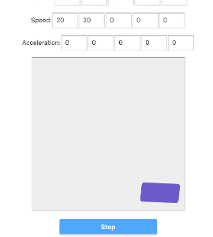

# CSS Motion Toy

Create CSS animations based on physics simulation.

Demo: https://tomsoderlund.github.io/css-motion-toy/

## How to Run

	yarn start

## How to Use

You set up your simulation configuration, then press “Start” to start.

### Simulation rules

- Bounce: reverse speed when hit a wall.
- Black hole: rotate around a position.
- Cannon: accelerate after a certain time.

### Simulation options

- Skew (on/off): use transform skew based on speed.
- Stretch (on/off): use transform scale based on speed.
- Friction (%)
